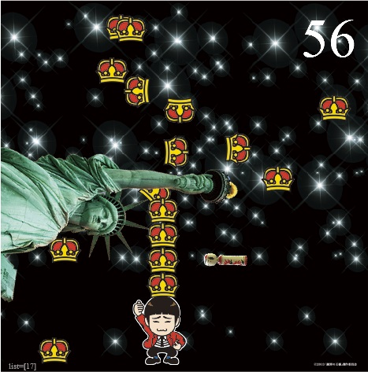
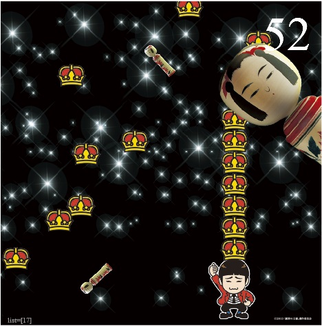

# TobisakoOhkanGame
空から王冠とお邪魔こけしが降ってきます。お邪魔こけしを避けながら、王冠を頭でキャッチして１０段まで積み上げればゲームクリア。 お邪魔こけしに３回当たるとゲームオーバーです。  
上手くよけても、左右から「巨大自由の女神・巨大こけし」が積み上げて王冠を崩そうと襲ってきます。  
上手くよけて、制限時間内にクリアを目指せ！  

# インストール方法

ゲームをプレイするだけなら、開発環境を用意する必要はありません。
インストーラー（TobisakoOhkanGame\TobiSyazaiFlash\air\TobiSyazaiFlashFRAME.air）をダブルクリックすれば、Windowsパソコンにゲームをインストールする事が出来ます。

＃実行には、Adobe Air環境が必要です。下記をご参考下さい。
<https://helpx.adobe.com/jp/air/kb/233632.html>

# 環境
開発環境は、以下です。  
　・FlashDevelop 4.6.4.1 for .NET 2.0（Air環境）
　・ActionSCript

# プログラム説明
本プログラムは、以下の特徴を持っています。  
・独自フレームワークを自作し画面遷移させています。（Progression4がAir環境で動作しなかった為）  
・ゲーム中のキャラクターは、ベースとなるスプライト・オブジェクトを継承した子クラスとして実装しています。  
・巨大キャラの動きは、Twinner()ライブラリを使用しました。  
・オブジェクト生成／メモリ開放のテストを厳密に行っており、安定性を重視しています。  

開発には、以下を参考にさせて頂きました。有難うございます。  
・プリローダー  
<http://www.sousakuba.com/weblabo/actionscript-now-loading.html>  
・Loadingアイコン  
<https://dribbble.com/shots/1096260-Loading-GIF-Animation>  
・GIF->SWF変換  
<http://hokanko2008.seesaa.net/article/130574091.html>  
・ＡＩＲ・ウィンドウフレームの表示／非表示  
<http://d.hatena.ne.jp/tomodrop/20080108/1199851464>  
・フルスクリーンモード  
<http://help.adobe.com/ja_JP/ActionScript/3.0_ProgrammingAS3/WS2E9C7F3B-6A7C-4c5d-8ADD-5B23446FBEEB.html>  
・AIRのapplication.xmlをAS3から取得する  
<http://d.hatena.ne.jp/nenjiru/20110620/1308562339>  
・関数インライン展開は高速  
<http://ton-up.net/blog/archives/1016>  

# とある改造方法
このプログラムは、元々は映画サイネージ・コンテンツ販促デモ用に使いたいと思ってオフ時間で開発し、プログラム・アピールに使いました。今回は、素材差し替え・ゲーム部のみ最初から起動する等の改造を行い、自分用の成果物記録としてgithubにアップしています。

以下の手順を踏めば、フルバージョンを閲覧する事が可能です。別テキスト(TobiSyazaiFlash\README_kaizou.txt)に改造方法を纏めていますので、興味がある方は、一度お試し下さい。  

# 終わりに
本作品は、2015年に、会社勉強会やプリセールス用デモ等で作成しました。また後輩達の教育用にも使用しています。  

(2016/9)
